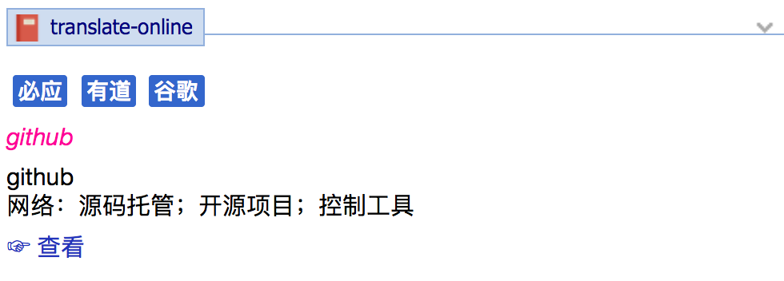

### Screenshot 屏幕截图：


### Java 安装：
[https://java.com/download/](https://java.com/download/)
* 安装时注意勾选项
* 不要安装推广软件

### GoldenDict 配置：
1. `Edit`-`Dictionaries`
2. `Sources`-`Programs`-`Add`
3. configure 按照表格配置-`OK`

key|value
---|-----
Enabled|✓
Type|Html
Name|translate-online
Command Line|java -jar C:\translate-online.jar %GDWORD%
Icon|C:\translate-online.png

### Tampermonkey 相关内容：
[https://greasyfork.org/zh-CN/scripts/34921-translate/](https://greasyfork.org/zh-CN/scripts/34921-translate/)

### build:
* maven `3`
* jdk `1.8` and `above`

```shell
mvn clean compile package -Dmaven.test.skip=true
```

### runtime:
* jdk `1.6` and `above`

### extension:
1. `class ***Parser extends Parser`
2. `Parser`-`static{...}`-`entryParser.put`
3. Done!

### release:
version|hash(SHA1) `translate-online.jar`
-------|----
2.0|`80d5aa5e8f529827c329e34d22183497182af681`
1.0|`80f648143f0410a679d9de4c83cccec7ddbf87b8`